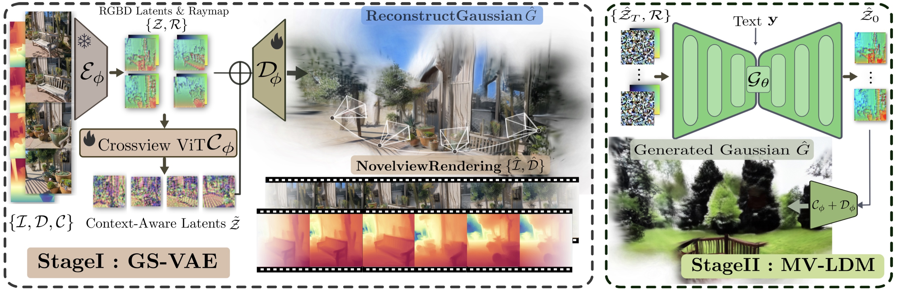

# Prometheus: 3D-Aware Latent Diffusion Models for Feed-Forward Text-to-3D Scene Generation

<!-- 
[Jiahao Shao*](https://jhaoshao.github.io/), Yuanbo Yang*, Hongyu Zhou, [Youmin Zhang](https://youmi-zym.github.io/),  [Yujun Shen](https://shenyujun.github.io/), [Vitor Guizilini](https://vitorguizilini.github.io/), [Yue Wang](https://yuewang.xyz/), [Matteo Poggi](https://mattpoggi.github.io/), [Yiyi Liao](https://yiyiliao.github.io/ ) -->

[](https://freemty.github.io/project-prometheus/) [](https://arxiv.org/pdf/2412.21117)

 <!-- [](https://huggingface.co/spaces/jhshao/ChronoDepth)
[](https://huggingface.co/jhshao/ChronoDepth-v1) -->

> **Prometheus: 3D-Aware Latent Diffusion Models for Feed-Forward Text-to-3D Scene Generation** <br>

> Yuanbo Yang, Jiahao Shao and Xinyang, Li and Yujun, Shen and Andreas, Geiger and Yiyi, Liao <br>

## Abstract


**Overview:** *We present a novel method for feed-forward scene-level 3D generation. At its core, our approach harnesses the power of 2D priors to fuel generalizable and efficient 3D synthesis – hence our name, <font color=#ff455c>Prometheus </font>🔥*


In this work, we introduce  <font color=#ff455c>Prometheus </font>🔥, a 3D-aware latent diffusion model for text-to-3D generation at both object and scene levels in seconds. We formulate 3D scene generation as multi-view, feed-forward, pixel-aligned 3D Gaussian generation within the latent diffusion paradigm. To ensure generalizability, we build our model upon pre-trained text-to-image generation model with only minimal adjustments, and further train it using a large number of images from both single-view and multi-view datasets. Furthermore, we introduce an RGB-D latent space into 3D Gaussian generation to disentangle appearance and geometry information, enabling efficient feed-forward generation of 3D Gaussians with better fidelity and geometry. Extensive experimental results demonstrate the effectiveness of our method in both feed-forward 3D Gaussian reconstruction and text-to-3D generation.

## Method



 Our training process is divided into two stages. In stage 1, our objective is to train a **GS-VAE**. Utilizing multi-view images along with their corresponding pseudo depth maps and camera poses, our GS-VAE is designed to encode these multi-view RGB-D images, integrate cross-view information, and ultimately decode them into pixel-aligned 3DGS. In stage 2, we focus on training a **MV-LDM**. We can generate multi-view RGB-D latents by sampling from randomly-sampled noise with trained MV-LDM.


## 📢 News
2024-12-21: Project Page and arxiv


## ✅ TODO
- [ ] Release inference code and checkpoint (Before 2025-01-10)
- [ ] Set up Online demo for inference (Before 2025-01-20)
- [ ] Release training code & dataset preparation

## 🎓 Citation

Please cite our paper if you find this repository useful:

```bibtex
@article{yang2024prometheus,
      title={Prometheus: 3D-Aware Latent Diffusion Models for Feed-Forward Text-to-3D Scene Generation}, 
      author={Yuanbo, Yang and Jiahao, Shao and Xinyang, Li and Yujun, Shen and Andreas, Geiger and Yiyi, Liao},
      year={2024},
      journal= {arxiv:2412.21117},
}
```